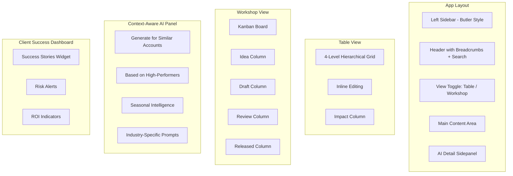

# Fuel 2.0 - AI-Native Content Factory Prototype

## Confirmed Scope

- All 3 Must-have features: Context-Aware AI, Client Success Dashboard, Account Customization
- Workshop/Kanban view alongside Table view
- Butler-style light theme (professional, clean)

## Architecture



## Tech Stack

- **Vite + React 18** - Fast development
- **Tailwind CSS v3** - Butler's clean aesthetic
- **Framer Motion** - Smooth transitions and drag-drop
- **Lucide React** - Icons
- **@dnd-kit** - Drag and drop for Kanban
- **date-fns** - Date formatting

## Visual Design

**Light Theme (Butler-style):**

- Background: White (#FFFFFF) with subtle gray borders (#E5E7EB)
- Cards: White with shadow-sm
- Text: Slate-900 (primary), Slate-500 (secondary)
- Accent: Teal-500 (#14B8A6) for AI features
- Status badges: Emerald (Live), Amber (Draft/Review), Sky (In Progress), Rose (Deprecated)

**Impact Indicators:**

- Fire icon (orange) = High impact (proven winners)
- TrendingUp icon (green) = Growing (promising data)
- AlertTriangle icon (amber) = Low adoption

## Implementation Details

### 1. Layout Shell

**Left Sidebar (240px):**

- Butler logo with "Fuel 2.0" badge
- Navigation groups: Administration, Page Info, Support Interface, OMD, **Fuel** (highlighted), Library
- Fuel section: Objectives and Tactics (active), Industry events, Custom scripts, Fuel profile labels

**Header:**

- Breadcrumbs: Fuel 2.0 > Objectives and Tactics
- Global search (Command+K style)
- **"View as" dropdown** - Switch between accounts (Nike, Ford, Generic)
- User avatar

**Sub-Header:**

- Tab bar: "Playbooks" | "Analytics" | "Perspectives"
- **View toggle**: Table View / Workshop View icons
- Action buttons: Filters, Create Tactic, Create Objective

### 2. Table View (Hierarchical Grid)

**4-Level Depth with New Impact Column:**

| Expand | Name | Type | Impact | Status | Quality | Targeting | Usage | Last Edit |

|--------|------|------|--------|--------|---------|-----------|-------|-----------|

| > | Increase Brand Awareness | Industry | Fire High | Live | 85 | Retail, EMEA | 245 | Filip, 2h ago |

|   > | Influencer Partnerships | - | TrendUp Growing | Live | 78 | Retail | 180 | - |

|     > | Micro-influencer outreach | - | - | Draft | 62 | - | - | - |

|       | Step 1: Identify creators | - | - | Draft | - | - | - | - |

**Features:**

- Recursive HierarchyRow component
- Click-to-edit inline fields
- Status dropdown with color badges
- Impact indicator column (High/Growing/Low adoption)
- Vertical connector lines for hierarchy visualization
- Smooth expand/collapse animations

### 3. Workshop View (Kanban Board)

**Four Columns:**

```
| Idea (5)        | Draft (3)       | Review (2)      | Released (8)    |
|-----------------|-----------------|-----------------|-----------------|
| [Card: TikTok   | [Card: Email    | [Card: Crisis   | [Card: Brand    |
|  Strategy]      |  Automation]    |  Protocol]      |  Awareness]     |
| [Card: AI       | [Card: Social   |                 | [Card: Social   |
|  Chatbot]       |  Listening]     |                 |  Monitoring]    |
```

**Card Content:**

- Title
- Type badge (Objective/Tactic)
- Impact indicator
- Quality score
- Targeting tags (max 2 visible)
- Usage count
- Drag handle

**Interactions:**

- Drag cards between columns (updates status)
- Click card to open Detail Sidepanel
- Add new card button in Idea column
- Column counts in headers

### 4. Context-Aware AI Sidepanel

**Header Section:**

- Item title + editable
- Status badge
- Breadcrumb: Objective > Tactic > Best Practice > Step

**"View as Account" Preview:**

- Dropdown: "Viewing as: Nike" / "Ford" / "Generic"
- Shows customized content based on account variables:
  - Budget: $50k (Nike) vs $5k (Generic)
  - Timeline: 3 months vs 6 weeks
  - Compliance: EU GDPR vs US only

**Content Editor:**

- Rich text area for description
- Targeting matrix (Industry, Region, Account multi-select)

**Context-Aware AI Section (Teal accent):**

**Generation Mode Selector:**

```
[Generate for Similar Accounts ▼]
- Similar to Nike (Retail, Enterprise)
- Similar to Ford (Automotive, Global)
- Based on High-Performers (top 10% usage)
- Seasonal: Q1 Focus
- Industry: Finance-specific
```

**"Generate Tactics" Button:**

- Pulsing "Grok is analyzing context..." animation
- Shows context being used: "Analyzing 245 accounts similar to Nike..."
- Result: 5 tactic cards with:
  - Relevance score (why this fits the context)
  - Preview text
  - "Apply" / "Discard" buttons

**"Quality Audit" Section:**

- AI-generated checklist
- "Add specific metrics for ROI tracking"
- "Clarify target audience for Finance segment"
- "Consider adding GDPR compliance step"

### 5. Client Success Dashboard (Analytics Tab)

**Top Alert Banner:**

```
⚠️ Risk Alert: 5 accounts have assigned objectives but 0 tactics completed - potential churn risk
[View Accounts]
```

**Success Stories Widget:**

```
🏆 Success Stories
┌─────────────────────────────────────────┐
│ Nike: "Influencer Partnerships" tactic  │
│ +35% engagement increase                │
│ Used by 180 accounts                    │
├─────────────────────────────────────────┤
│ Ford: "Crisis Communication Protocol"   │
│ 100% completion rate                    │
│ Prevented 3 PR incidents                │
└─────────────────────────────────────────┘
```

**Metrics Grid (4 cards):**

- Total Objectives (12) with trend sparkline
- Total Tactics (47) with trend sparkline  
- Avg Completion Rate (78%) with trend
- Content Health Score (85/100)

**ROI Indicators Table:**

| Tactic | Adoption | Impact | Linked to Renewals | Linked to Upsells |

|--------|----------|--------|-------------------|-------------------|

| Influencer Partnerships | 180 | High | 23 accounts | 8 accounts |

| Social Monitoring | 245 | High | 31 accounts | 12 accounts |

**Gap Analysis Section:**

- "Finance industry lacks TikTok tactics" [Generate with AI]
- "APAC region has low Influencer coverage" [Generate with AI]
- "Q2 predicted demand: Social Commerce" [Prepare Content]

### 6. Perspective Switcher

**Segmented Control:**

- By Hierarchy (default tree)
- By Industry (Retail, Finance, Healthcare, Tech groups)
- By Account (Nike, Ford, Generic groups)

Each perspective re-groups the content with smooth animation.

### 7. Global Search

**Natural Language Support:**

- "Show me all Draft tactics for Nike"
- "Find high-impact tactics for Retail"
- "What's the most used objective?"

Results with highlighted matches, grouped by level.

### 8. Preview Modal

"Preview in app.emplifi.io" button:

- Device toggle: Mobile / Desktop
- Account context: "Previewing as Nike"
- Rendered content card appearance

## File Structure

```
src/
├── components/
│   ├── layout/
│   │   ├── Sidebar.jsx
│   │   ├── Header.jsx
│   │   ├── TabBar.jsx
│   │   ├── ViewToggle.jsx
│   │   └── AppLayout.jsx
│   ├── playbooks/
│   │   ├── PlaybooksView.jsx
│   │   ├── HierarchyRow.jsx
│   │   ├── InlineEditor.jsx
│   │   ├── StatusDropdown.jsx
│   │   ├── QualityScore.jsx
│   │   ├── ImpactBadge.jsx
│   │   └── TargetingPills.jsx
│   ├── workshop/
│   │   ├── WorkshopView.jsx
│   │   ├── KanbanColumn.jsx
│   │   └── TacticCard.jsx
│   ├── analytics/
│   │   ├── AnalyticsView.jsx
│   │   ├── RiskAlertBanner.jsx
│   │   ├── SuccessStoriesWidget.jsx
│   │   ├── MetricCard.jsx
│   │   ├── Sparkline.jsx
│   │   ├── ROITable.jsx
│   │   └── GapAnalysis.jsx
│   ├── perspectives/
│   │   └── PerspectiveView.jsx
│   ├── detail-panel/
│   │   ├── DetailSidepanel.jsx
│   │   ├── ViewAsAccount.jsx
│   │   ├── ContentEditor.jsx
│   │   ├── ContextAwareAI.jsx
│   │   └── QualityAudit.jsx
│   └── common/
│       ├── SearchBar.jsx
│       └── PreviewModal.jsx
├── data/
│   ├── seedData.js
│   ├── accountProfiles.js
│   └── successStories.js
├── context/
│   └── FuelContext.jsx
├── App.jsx
├── main.jsx
└── index.css
```

## Seed Data Requirements

**Content Hierarchy (50+ items):**

- 5 Objectives with varying statuses and impact levels
- 15+ Tactics distributed across objectives
- 25+ Best Practices
- 30+ Steps

**Account Profiles:**

- Nike: Retail, Enterprise, $50k budget, EU+US
- Ford: Automotive, Global, $100k budget, All regions
- Generic: SMB template, $5k budget, US only

**Success Stories:**

- 5 case studies with metrics
- Linked to specific tactics

**Usage Metrics:**

- Adoption counts (50-500)
- Completion rates (30-95%)
- Renewal/Upsell linkage data
- 7-day trend data for sparklines