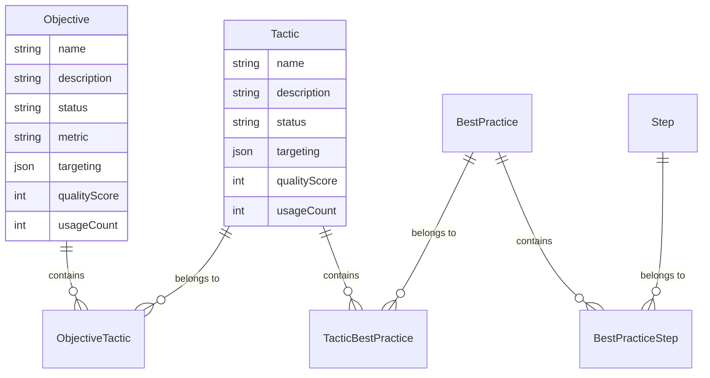
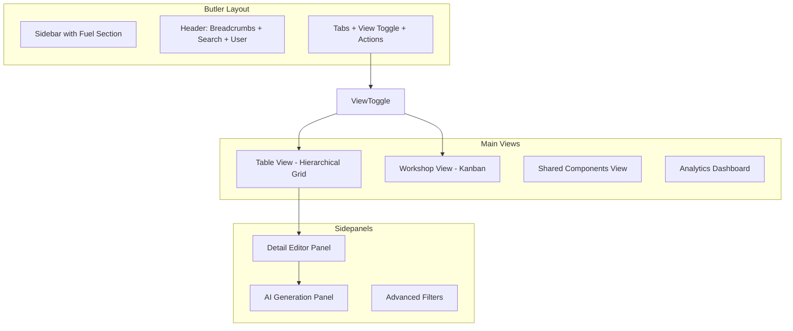

# Fuel 2.0 - AI-Native Content Factory

## What We're Building

Butler section for creating human-curated AI training content. Elizabeth and team create objectives/tactics that customers use in app.emplifi.io. AI generates content fast (including variants), humans control quality and approve.

**Current state:** ~5 users, dozens of items

**Future state:** ~30 users, hundreds/thousands of variants

## Critical Data Model



**Many-to-Many Relationships:**

- 1 Tactic can be in multiple Objectives
- 1 Best Practice can be in multiple Tactics
- 1 Step can be in multiple Best Practices

**Targeting Dimensions (all levels):**

- Industry: Finance, Retail, Healthcare, Tech...
- Region: EMEA, NA, APAC
- Job Role: CMO, Social Media Manager, Analyst...
- Account: Nike, Ford, "All"

**Status Workflow:**

Draft → In Review → Approved → Released

## Tech Stack

- **Vite + React 18**
- **Tailwind CSS v3** - Butler's clean light theme
- **Framer Motion** - Animations
- **@dnd-kit/core** - Drag-drop for Kanban
- **Lucide React** - Icons
- **date-fns** - Dates

## Architecture



## Implementation Details

### 1. Layout (Butler-Style Light Theme)

**Left Sidebar (240px):**

```
Butler Logo
─────────────────
Administration
  Users
  Permissions
─────────────────
Page Info
  Page Info
  Page Tagging
─────────────────
Support Interface
  Accounts
  Users
─────────────────
OMD
  Business Toggles
─────────────────
Fuel                    ← Active section
  Objectives & Tactics  ← Current view
  Industry Events
  Custom Scripts
  Fuel Profile Labels
─────────────────
Library / Components
  Storybook
```

**Header:**

- Breadcrumbs: Fuel 2.0 > Objectives & Tactics
- Global Search (Command+K)
- User Avatar + Role badge (Admin/Editor/Reviewer/Viewer)

**Sub-Header:**

- Tabs: "Content" | "Shared Components" | "Analytics"
- View Toggle: Table / Workshop icons
- Actions: [Filters] [+ Create Objective] [+ Create Tactic]

### 2. Table View (Hierarchical with Many-to-Many)

**Columns:**

| Expand | Type | Name | Targeting | Status | Quality | Usage | Last Edit | Actions |

**Row Structure:**

```
▶ OBJ  Increase Brand Awareness     🏭Retail 🌍EMEA 👤CMO    In Review  85  245 accts  Filip, 2h
  ▶ TAC  Influencer Partnerships    🏭Retail              Approved   78  180 accts  Used in 2 objectives
    ▶ BP   Micro-influencer outreach                     Draft      62  -          Used in 3 tactics
      STEP  Identify creators                            Draft      -   -
      STEP  Outreach template                            Draft      -   -
```

**Many-to-Many Indicator:**

- "Used in X objectives/tactics" pill on shared items
- Click to see list of parent items
- Warning icon if editing shared component

**Inline Editing:**

- Click name to edit
- Status dropdown (Draft/In Review/Approved/Released)
- Targeting pills clickable to modify

**Expand/Collapse:**

- Smooth Framer Motion animation
- Vertical connector lines
- Depth-based indentation (24px per level)

### 3. Workshop View (Kanban)

**Four Columns:**

```
┌─────────────┬─────────────┬─────────────┬─────────────┐
│ Draft (12)  │ In Review(5)│ Approved (8)│ Released(23)│
├─────────────┼─────────────┼─────────────┼─────────────┤
│ ┌─────────┐ │ ┌─────────┐ │ ┌─────────┐ │ ┌─────────┐ │
│ │OBJ Brand│ │ │TAC Email│ │ │OBJ Lead │ │ │TAC Social│
│ │Awareness│ │ │Campaign │ │ │Gen      │ │ │Monitor   │
│ │         │ │ │         │ │ │         │ │ │          │
│ │🏭Retail │ │ │Score:72 │ │ │Score:91 │ │ │245 accts │
│ │Score:85 │ │ │         │ │ │         │ │ │          │
│ └─────────┘ │ └─────────┘ │ └─────────┘ │ └─────────┘ │
│ ┌─────────┐ │             │             │             │
│ │TAC Influ│ │             │             │             │
│ │encer   │ │             │             │             │
│ └─────────┘ │             │             │             │
└─────────────┴─────────────┴─────────────┴─────────────┘
```

**Card Content:**

- Type badge (OBJ/TAC/BP/STEP)
- Name
- Targeting pills (max 2)
- Quality Score
- Usage count (if Released)
- "Used in X" indicator for shared items

**Drag-Drop:**

- Drag between columns to change status
- Animation feedback
- Validation: Can't drag to Released without Approved first

### 4. Shared Components View

**Purpose:** Manage reusable best practices and steps

**Table:**

| Type | Name | Used In | Targeting | Quality | Actions |

**Example:**

```
BP   Set up social listening     5 tactics    🏭All    85    [Edit Global] [View Usage]
BP   Crisis response checklist   3 tactics    🏭All    92    [Edit Global] [View Usage]
STEP Identify key influencers    8 BPs        🏭Retail 78    [Edit Global] [View Usage]
```

**Edit Modal:**

- "Edit Globally" - updates all instances
- "Create Variant" - creates copy for specific context
- Warning: "This will affect 5 tactics. Continue?"

### 5. AI Generation Panel (Sidepanel)

**Trigger:** [Generate] button on any item

**Panel Content:**

```
┌────────────────────────────────────────┐
│ ✨ Generate Content                    │
│ ────────────────────────────────────── │
│ Parent: Increase Brand Awareness       │
│                                        │
│ Generate:                              │
│ ○ Tactics  ○ Best Practices  ○ Steps   │
│                                        │
│ Quantity: [5] ▼                        │
│                                        │
│ ─── Target Variants ───                │
│ ☑ Industry                             │
│   [Finance ✓] [Retail ✓] [Healthcare]  │
│                                        │
│ ☑ Region                               │
│   [EMEA ✓] [NA] [APAC]                 │
│                                        │
│ ☑ Job Role                             │
│   [CMO ✓] [Social Media Manager]       │
│                                        │
│ □ Language Variants                    │
│   [EN ✓] [DE] [FR] [ES]                │
│                                        │
│ ─── Custom Prompt (optional) ───       │
│ ┌──────────────────────────────────┐   │
│ │Focus on budget-friendly tactics  │   │
│ │for small teams...                │   │
│ └──────────────────────────────────┘   │
│                                        │
│ Preview: Will generate 10 variants     │
│ (5 base × 2 industries)                │
│                                        │
│ [Cancel]        [✨ Generate with Grok]│
└────────────────────────────────────────┘
```

**Generation Flow:**

1. User configures options
2. Click [Generate with Grok]
3. Pulsing animation: "Grok is generating..."
4. Results appear as cards:
   ```
   ┌─────────────────────────────────┐
   │ Generated Tactic 1/10           │
   │ "Social Listening for Finance"  │
   │                                 │
   │ Quality Score: 87/100           │
   │ ✓ Relevant to Finance           │
   │ ✓ Complete description          │
   │ ⚠ Consider adding metrics       │
   │                                 │
   │ [Edit] [Accept as Draft] [Skip] │
   └─────────────────────────────────┘
   ```

5. User reviews each, accepts or skips
6. Accepted items added to content with Draft status

### 6. Detail Editor Panel

**Opens when clicking any row**

```
┌────────────────────────────────────────┐
│ Influencer Partnerships           [×]  │
│ TACTIC · Draft · Score: 78             │
│ ────────────────────────────────────── │
│ Used in: Brand Awareness, Lead Gen     │
│ ────────────────────────────────────── │
│                                        │
│ Description:                           │
│ ┌──────────────────────────────────┐   │
│ │Partner with micro-influencers    │   │
│ │to expand brand reach...          │   │
│ └──────────────────────────────────┘   │
│                                        │
│ ─── Targeting ───                      │
│ Industry: [Finance ×] [Retail ×] [+]   │
│ Region:   [EMEA ×] [+]                 │
│ Job Role: [CMO ×] [Social Media Mgr ×] │
│ Account:  [All Accounts ▼]             │
│                                        │
│ ─── Quality Audit ───                  │
│ Score: 78/100                          │
│ ✓ Relevant to target audience          │
│ ✓ Complete information                 │
│ ⚠ Could improve clarity in step 3      │
│ ✓ Consistent with brand guidelines     │
│                                        │
│ ─── Actions ───                        │
│ [✨ Generate Variants]                 │
│ [📋 Duplicate]                         │
│ [🔗 View in app.emplifi.io]            │
│                                        │
│ ─── Activity ───                       │
│ Filip edited · 2 hours ago             │
│ AI generated · 3 days ago              │
│ Elizabeth approved · 1 week ago        │
│                                        │
│ [Save Changes]  Status: [In Review ▼]  │
└────────────────────────────────────────┘
```

### 7. Analytics Dashboard

**Risk Alert Banner:**

```
⚠️ 5 accounts have objectives but 0 completed tactics - churn risk
[View Accounts]
```

**Metrics Grid:**

| Objectives | Tactics | Avg Quality | Avg Completion |

|------------|---------|-------------|----------------|

| 24         | 89      | 82/100      | 76%            |

| +3 this mo | +12     | ↗️ +5       | ↗️ +8%         |

**Top Performers:**

| Tactic | Usage | Trend | Impact |

|--------|-------|-------|--------|

| Social Monitoring | 245 | ↗️ | High |

| Influencer Partnerships | 180 | ↗️ | High |

**Gap Analysis (AI-Powered):**

```
💡 Recommended Actions:
• Finance industry lacks TikTok tactics [Generate with AI]
• Only 2 Conversion tactics vs 12 Awareness [Generate more]
• Q2 prediction: Social commerce demand +40% [Prepare content]
```

**Predictive Insights:**

- Learning from usage patterns
- Suggesting content based on what works
- Seasonal recommendations

### 8. Advanced Filters Panel

```
┌────────────────────────────────────────┐
│ 🔍 Filters                        [×]  │
│ ────────────────────────────────────── │
│ Search: [social monitoring        ]    │
│                                        │
│ Type:                                  │
│ [✓] Objectives  [✓] Tactics            │
│ [✓] Best Practices  [✓] Steps          │
│                                        │
│ Status:                                │
│ [✓] Draft  [✓] In Review               │
│ [ ] Approved  [ ] Released             │
│                                        │
│ Industry:                              │
│ [✓] Finance  [✓] Retail  [ ] Healthcare│
│                                        │
│ Region:                                │
│ [✓] EMEA  [ ] NA  [ ] APAC             │
│                                        │
│ Job Role:                              │
│ [✓] CMO  [ ] Social Media Manager      │
│                                        │
│ Quality Score: [> 70    ▼]             │
│ Usage: [> 10 accounts   ▼]             │
│                                        │
│ ─── Saved Views ───                    │
│ • My drafts awaiting review            │
│ • High-performing (Finance)            │
│ • Low adoption items                   │
│                                        │
│ [Reset]              [Apply Filters]   │
└────────────────────────────────────────┘
```

## File Structure

```
src/
├── components/
│   ├── layout/
│   │   ├── Sidebar.jsx
│   │   ├── Header.jsx
│   │   ├── SubHeader.jsx
│   │   └── AppLayout.jsx
│   ├── table-view/
│   │   ├── TableView.jsx
│   │   ├── HierarchyRow.jsx
│   │   ├── InlineEditor.jsx
│   │   ├── StatusDropdown.jsx
│   │   ├── TargetingPills.jsx
│   │   ├── QualityScore.jsx
│   │   └── UsedInBadge.jsx
│   ├── workshop-view/
│   │   ├── WorkshopView.jsx
│   │   ├── KanbanColumn.jsx
│   │   └── ContentCard.jsx
│   ├── shared-components/
│   │   ├── SharedComponentsView.jsx
│   │   └── ComponentUsageModal.jsx
│   ├── analytics/
│   │   ├── AnalyticsView.jsx
│   │   ├── RiskAlert.jsx
│   │   ├── MetricsGrid.jsx
│   │   ├── TopPerformers.jsx
│   │   └── GapAnalysis.jsx
│   ├── panels/
│   │   ├── DetailPanel.jsx
│   │   ├── AIGenerationPanel.jsx
│   │   ├── FilterPanel.jsx
│   │   └── QualityAudit.jsx
│   └── common/
│       ├── SearchBar.jsx
│       ├── Badge.jsx
│       └── Modal.jsx
├── data/
│   ├── seedData.js
│   ├── relationships.js
│   └── mockUsageData.js
├── context/
│   └── FuelContext.jsx
├── hooks/
│   ├── useSearch.js
│   └── useFilters.js
├── App.jsx
├── main.jsx
└── index.css
```

## Seed Data Requirements

**Content with Many-to-Many:**

- 5 Objectives
- 15 Tactics (some shared across objectives)
- 20 Best Practices (some shared across tactics)
- 30 Steps (some shared across best practices)

**Targeting Coverage:**

- Industries: Finance, Retail, Healthcare, Tech
- Regions: EMEA, NA, APAC
- Job Roles: CMO, Social Media Manager, Analyst, Content Creator
- Accounts: Nike, Ford, Adidas, Generic/All

**Usage Metrics:**

- Adoption counts, completion rates
- 7-day trend data
- Impact scores