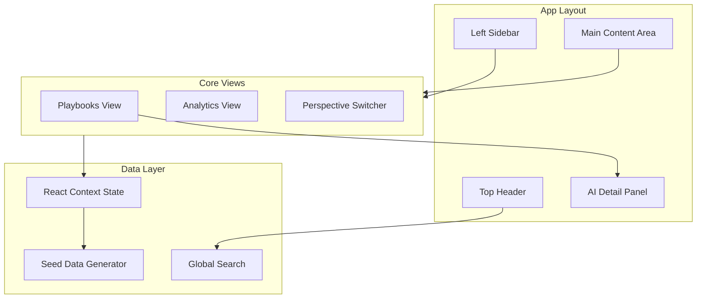

# Fuel 2.0 Content Factory Prototype

## Architecture Overview



## Tech Stack

- **Vite + React 18** - Fast development and HMR
- **Tailwind CSS v3** - Utility-first styling with custom design tokens
- **Framer Motion** - Smooth view transitions and micro-interactions
- **Lucide React** - Icon library (Zap, Brain, BarChart3, Layers, Filter, etc.)
- **date-fns** - Date formatting for timestamps

## Project Structure

```
src/
├── components/
│   ├── layout/
│   │   ├── Sidebar.jsx
│   │   ├── Header.jsx
│   │   └── AppLayout.jsx
│   ├── playbooks/
│   │   ├── PlaybooksView.jsx
│   │   ├── HierarchyRow.jsx
│   │   ├── InlineEditor.jsx
│   │   └── StatusBadge.jsx
│   ├── analytics/
│   │   ├── AnalyticsView.jsx
│   │   ├── MetricCard.jsx
│   │   └── Sparkline.jsx
│   ├── perspectives/
│   │   └── PerspectiveSwitcher.jsx
│   ├── detail-panel/
│   │   ├── DetailSidepanel.jsx
│   │   ├── ContentEditor.jsx
│   │   └── GrokAISection.jsx
│   └── common/
│       ├── SearchBar.jsx
│       ├── TabBar.jsx
│       ├── PreviewModal.jsx
│       └── TargetingTags.jsx
├── data/
│   └── seedData.js
├── context/
│   └── FuelContext.jsx
├── hooks/
│   └── useSearch.js
├── App.jsx
├── main.jsx
└── index.css
```

## Design System

**Color Palette (Dark professional theme):**

- Background: Slate 900/950 tones
- Accent: Violet/Indigo gradient for AI features
- Status colors: Emerald (Live), Amber (Review), Sky (Draft), Rose (Archived)
- Text: Slate 100/300/500 hierarchy

**Typography:**

- Font: JetBrains Mono for data, Plus Jakarta Sans for UI
- Monospace accents for scores and metrics

## Implementation Details

### 1. Layout Shell

- Fixed left sidebar (280px) with Butler branding and Fuel 2.0 nav section
- Sticky header with breadcrumbs, global search (Command+K style), user avatar
- Main content with smooth view transitions via AnimatePresence

### 2. Playbooks View (Hierarchical Grid)

- Recursive `HierarchyRow` component supporting 4 levels with depth-based indentation
- Vertical connector lines using CSS pseudo-elements
- Expand/collapse with chevron icons and animated height transitions
- Each row displays: Title (editable), Status Badge, Quality Score (circular progress), Targeting Tags
- Click-to-edit inline fields with auto-save simulation

### 3. Analytics View

- Metric cards grid: "Top Performing Objectives", "Lowest Completion Tactics"
- SVG sparkline charts showing 7-day usage trends
- "Gap Analysis" section with AI-recommended actions
- Data synced from mock `app.emplifi.io` metrics

### 4. Perspective Switcher

- Segmented control toggle: "Hierarchy" | "By Industry" | "By Account"
- Industry view groups items by Retail, Finance, Healthcare, Tech tags
- Account view shows premium client content (Nike, Ford, etc.)
- Smooth re-grouping animation when switching

### 5. AI Detail Sidepanel

- Slides in from right (400px width) with Framer Motion
- Rich text content area (simulated)
- **Grok AI Integration:**
  - "Generate Variants" button triggers pulsing animation + "Grok is thinking..." state
  - After 2s delay, renders 3 industry-specific variant cards
  - "Quality Audit" shows AI tips as checklist items
- Close button and keyboard escape handling

### 6. Seed Data

- Generate realistic marketing content tree:
  - 5 Objectives (Influencer Marketing, SEO Strategy, Social Ads, etc.)
  - 3-4 Tactics per Objective
  - 2-3 Best Practices per Tactic
  - 2-4 Steps per Best Practice
- Each item has: id, title, description, status, qualityScore, targetingTags, usage metrics

### 7. Global Search

- Fuzzy search across all hierarchy levels
- Highlights matching terms
- Real-time filtering as user types

### 8. Preview Modal

- "Preview in app.emplifi.io" button
- Renders device frame (mobile/desktop toggle)
- Shows content card as it would appear in production

## Key Files to Create

1. `package.json` - Dependencies and scripts
2. `vite.config.js` - Vite configuration
3. `tailwind.config.js` - Custom theme with design tokens
4. `src/data/seedData.js` - Comprehensive marketing content tree
5. `src/context/FuelContext.jsx` - Global state management
6. `src/components/layout/AppLayout.jsx` - Main shell
7. `src/components/playbooks/PlaybooksView.jsx` - Core hierarchical view
8. `src/components/detail-panel/DetailSidepanel.jsx` - AI-powered detail editor