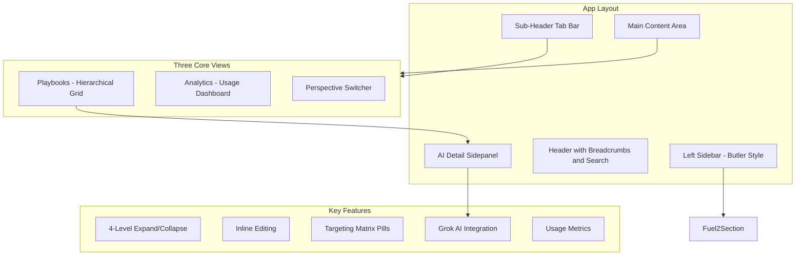

# Fuel 2.0 - AI-Native Content Factory Prototype

## Problem Being Solved

Butler is too rigid - it's hard to see what's released, for whom, and what's in draft. Information gets lost across multiple Excels. The goal is to create a unified view where Elizabeth can:

- See all relationships at a glance (which tactic belongs to which objective, in what state)
- Generate content with AI directly in the tool (no copy-paste from Gemini)
- View granular targeting (industry, account, region)
- Track real usage data from app.emplifi.io

## Architecture



## Tech Stack

- **Vite + React 18** - Fast development
- **Tailwind CSS v3** - Matches Butler's clean aesthetic
- **Framer Motion** - Smooth transitions
- **Lucide React** - Icons (Zap, Brain, BarChart3, Layers, Filter, ChevronRight, etc.)
- **date-fns** - Date formatting

## Visual Design Direction

Following Butler's existing style from the v0 prototype:

- **Light theme** with white/gray backgrounds (not dark)
- **Clean table-based layouts** with subtle borders
- **Color-coded status badges**: Green (Done/Live), Yellow (Draft), Blue (In Progress), Red (Deprecated)
- **Teal/cyan accents** for AI features (inspired by Fuel 2.0 prototype)
- **Typography**: System fonts for UI, monospace for metrics/scores

## Implementation Details

### 1. Layout Shell (Matches Butler Structure)

**Left Sidebar (240px)**:

- Butler logo/branding at top
- Grouped navigation sections (Administration, Page Info, Support Interface, OMD, **Fuel**, Library)
- "Fuel" section highlighted with: Objectives & Tactics, Industry events, Custom scripts, Fuel profile labels
- Collapse button at bottom

**Header**:

- Breadcrumbs: Fuel 2.0 > Objectives & Tactics > [Current View]
- Global search with Command+K style activation
- User avatar with dropdown

**Sub-Header Tab Bar**:

- Three tabs: "Playbooks" | "Analytics" | "Perspectives"
- Action buttons on right: Filters, Create Tactic, Create Objective

### 2. Playbooks View (The Everything View)

**Hierarchical Grid** with 4-level depth:

```
[>] Objective: Increase Brand Awareness    | Industry | Live  | 85 | Retail, EMEA | 245 accounts
    [>] Tactic: Influencer Partnerships    | -        | Live  | 78 | Retail       | 180 accounts
        [>] Best Practice: Micro-influencer outreach | Draft | 62 | -     | -
            Step 1: Identify relevant creators       | Draft | -  | -     | -
            Step 2: Initial outreach template        | Draft | -  | -     | -
        [>] Best Practice: Content collaboration     | Live  | 91 | -     | -
    [>] Tactic: Social Media Contests      | -        | Review| 54 | Finance      | 92 accounts
```

**Columns**:

- Expand/Collapse chevron
- Title (inline editable)
- Visibility type (Account, Industry, Internal)
- Status dropdown (Idea, Draft, In Progress, Review, Done, Live, Deprecated)
- Quality Score (0-100 with color indicator)
- Targeting Tags (Industry, Region, Account pills)
- Usage metrics (account adoption count)
- Last edited by + timestamp

**Interactions**:

- Click chevron to expand/collapse with smooth animation
- Click title to inline edit
- Status is a dropdown (like v0 prototype)
- Vertical connector lines showing hierarchy depth
- Row hover highlighting

### 3. Analytics View (Usage Dashboard)

**Top Metrics Cards** (4-column grid):

- Total Objectives (with trend sparkline)
- Total Tactics (with trend sparkline)
- Avg Completion Rate (percentage)
- Content Health Score (0-100)

**Performance Tables**:

- "Top Performing Objectives" - sorted by adoption rate
- "Lowest Completion Tactics" - sorted by completion %
- Each row shows: Name, Usage Count, Trend sparkline, Action button

**Gap Analysis Section**:

- AI-powered recommendations
- "Industry: Finance lacks TikTok tactics"
- "Region: APAC has low coverage for Influencer objectives"
- Each with "Generate with Grok" action button

### 4. Perspective Switcher

**Segmented Control Toggle**:

- "By Hierarchy" (default tree view)
- "By Industry" (groups all items by Retail, Finance, Healthcare, Tech tags)
- "By Account" (shows content for premium clients: Nike, Ford, etc.)

When switching perspectives, the grid re-groups with smooth animation while maintaining expand/collapse state where possible.

### 5. AI Detail Sidepanel (The Grok Panel)

Slides in from right (420px width) when clicking any row.

**Header**:

- Item title + status badge
- Close button
- Breadcrumb showing: Objective > Tactic > Best Practice

**Content Section**:

- Rich text editor area for description
- Targeting configuration (multi-select for Industry, Region, Account)

**Grok AI Section** (teal-accented):

- **"Generate Variants" button**:
  - Triggers pulsing "Grok is thinking..." animation
  - After 2s, shows 3 industry-specific variant cards
  - Each variant has: Title, Preview text, "Apply" button

- **"Generate More Tactics" button** (for Objectives):
  - Creates new tactics in "Idea" state
  - Shows as inline cards that can be reviewed/discarded

- **"Quality Audit" section**:
  - AI-generated improvement tips
  - Checklist format: "Add specific metrics", "Clarify target audience", etc.

### 6. Seed Data Structure

Comprehensive marketing content hierarchy:

**5 Objectives**:

1. Increase Brand Awareness (Retail focus)
2. Drive Website Traffic (E-commerce)
3. Improve Customer Engagement (All industries)
4. Generate Leads (B2B, Finance)
5. Crisis Communication Readiness (Enterprise)

Each Objective has:

- 3-4 Tactics with varying statuses
- Each Tactic has 2-3 Best Practices
- Each Best Practice has 2-4 Steps

**Usage Data Mock**:

- Adoption counts (50-500 accounts)
- Completion rates (30-95%)
- 7-day trend data for sparklines

### 7. Global Search

- Fuzzy search across all hierarchy levels
- Searches: title, description, targeting tags
- Results highlight matching terms
- Real-time filtering as user types
- Results grouped by level (Objectives, Tactics, etc.)

### 8. Preview Modal

"Preview in app.emplifi.io" button opens modal showing:

- Device frame toggle (Mobile / Desktop)
- Rendered preview of how the content card appears in production
- "Open in app" link (simulated)

## File Structure

```
src/
├── components/
│   ├── layout/
│   │   ├── Sidebar.jsx          # Butler-style navigation
│   │   ├── Header.jsx           # Breadcrumbs, search, user
│   │   ├── TabBar.jsx           # View switcher tabs
│   │   └── AppLayout.jsx        # Main shell
│   ├── playbooks/
│   │   ├── PlaybooksView.jsx    # Main hierarchical view
│   │   ├── HierarchyRow.jsx     # Recursive expandable row
│   │   ├── InlineEditor.jsx     # Click-to-edit field
│   │   ├── StatusDropdown.jsx   # Status selector
│   │   ├── QualityScore.jsx     # Score indicator
│   │   └── TargetingPills.jsx   # Tag pills display
│   ├── analytics/
│   │   ├── AnalyticsView.jsx    # Dashboard view
│   │   ├── MetricCard.jsx       # Stats card component
│   │   ├── Sparkline.jsx        # Mini trend chart
│   │   └── GapAnalysis.jsx      # AI recommendations
│   ├── perspectives/
│   │   └── PerspectiveView.jsx  # Grouped views
│   ├── detail-panel/
│   │   ├── DetailSidepanel.jsx  # Main sidepanel
│   │   ├── ContentEditor.jsx    # Rich text area
│   │   └── GrokAISection.jsx    # AI features
│   ├── common/
│   │   ├── SearchBar.jsx        # Global search
│   │   └── PreviewModal.jsx     # app.emplifi.io preview
├── data/
│   └── seedData.js              # Full content hierarchy
├── context/
│   └── FuelContext.jsx          # Global state
├── App.jsx
├── main.jsx
└── index.css                    # Tailwind + custom styles
```

## Key Files to Create

1. `package.json` - Project dependencies
2. `vite.config.js` - Build configuration
3. `tailwind.config.js` - Custom theme matching Butler
4. `src/data/seedData.js` - Comprehensive 4-level hierarchy with 50+ items
5. `src/context/FuelContext.jsx` - State for expand/collapse, selection, editing
6. `src/components/layout/AppLayout.jsx` - Main layout matching Butler
7. `src/components/playbooks/PlaybooksView.jsx` - Core hierarchical grid
8. `src/components/playbooks/HierarchyRow.jsx` - Recursive row with all features
9. `src/components/detail-panel/DetailSidepanel.jsx` - AI-powered editor panel
10. `src/components/analytics/AnalyticsView.jsx` - Usage dashboard